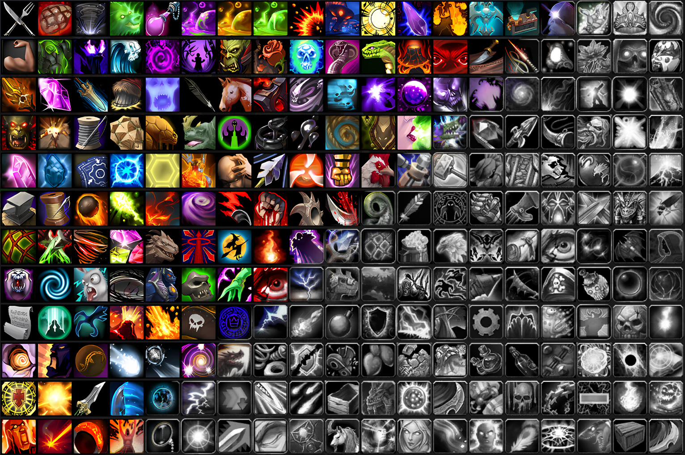

# Clean Icons - Mechagnome Edition

 

This repository is used as a distribution platform for `Clean Icons - Mechagnome Edition` project.

[Comparison vs default Blizzard icons](https://acidweb.github.io/Clean-Icons-Mechagnome-Edition/)

Check https://www.wowinterface.com/downloads/info25064-CleanIcons-MechagnomeEdition for more details.

**Current release:** 12.0.0.65512-V5-1
